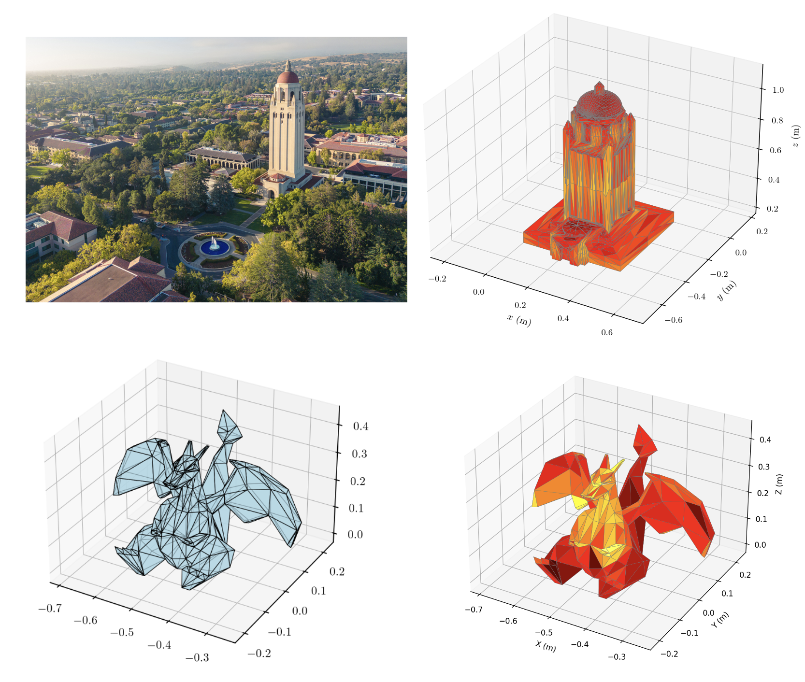
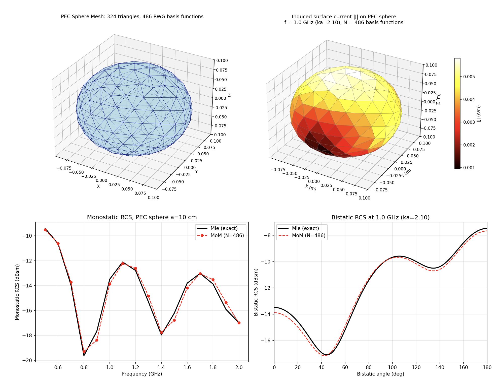

# pyMoM3d


A Python library implementing a 3D Method of Moments (MoM) electromagnetic solver using RWG (Rao-Wilton-Glisson) basis functions on triangular surface meshes.

`pyMoM3d` solves the Electric Field Integral Equation (EFIE), Magnetic Field Integral Equation (MFIE), and Combined Field Integral Equation (CFIE) for induced surface currents on perfect electric conductors (PEC). It computes far-field radiation patterns, radar cross section (RCS), input impedance, and multi-port Z/Y/S network parameters. Performance-critical assembly is implemented in C++17 with OpenMP parallelism.




## Features

- **Geometry primitives**: Rectangular plate, sphere, cylinder, cube, pyramid — all meshed directly via Gmsh
- **STL/OBJ import**: Load external mesh files (`.stl`, `.obj`) with automatic quality assessment and optional remeshing
- **Automatic meshing**: High-quality triangular surface meshes via [Gmsh](https://gmsh.info/) with configurable refinement and forced feed-edge alignment
- **RWG basis functions**: Automatic detection of interior/boundary edges and basis function assignment
- **EFIE / MFIE / CFIE formulations**: Full dense Z-matrix assembly with singularity extraction (Graglia 1993). CFIE eliminates interior resonances on closed surfaces via the Mautz–Harrington combination
- **C++ acceleration backend**: Performance-critical impedance fill implemented in C++17 with OpenMP parallelism and 32×32 cache-blocked matrix assembly; Numba JIT backend also available. Typically 100–500× faster than pure Python
- **Lumped port modeling**: `Port` objects define feed terminals from mesh geometry; single-ended or differential ports; multi-port batched solve (one LU factorization, P back-substitutions)
- **Multi-port network extraction**: `NetworkExtractor` extracts the full P×P Z-matrix; Y and S (power-wave) parameters derived on demand; reference plane de-embedding
- **Excitation sources**: Plane wave, single-edge delta-gap, strip delta-gap, multi-port excitation
- **Solvers**: Direct (LU) and iterative (GMRES with diagonal preconditioner)
- **Post-processing**: Far-field computation, bistatic/monostatic RCS, input impedance, S-parameters, directivity, beamwidth
- **Antenna arrays**: `LinearDipoleArray` with mutual coupling, beam steering, and array factor computation
- **Validation**: Built-in Mie series for PEC sphere RCS comparison
- **Visualization**: 3D mesh rendering, surface current density heatmaps, current vector plots
- **Reporting**: Terminal progress reporter and structured text simulation reports

## Quick Start

```bash
git clone https://github.com/your-username/pyMoM3d.git
cd pyMoM3d
pip install -r requirements.txt
pip install -e .

# Optional: build C++ acceleration backend (~100-500x faster matrix fill)
python build_cpp.py build_ext --inplace

python examples/sphere_rcs_validation.py
```

### Scattering (EFIE or CFIE)

```python
import numpy as np
from pyMoM3d import (
    Sphere, GmshMesher, compute_rwg_connectivity,
    Simulation, SimulationConfig, PlaneWaveExcitation,
    eta0, c0,
)

# EFIE — plane-wave scattering off a sphere
exc = PlaneWaveExcitation(E0=np.array([1, 0, 0]), k_hat=np.array([0, 0, -1]))
config = SimulationConfig(frequency=1.5e9, excitation=exc)
sim = Simulation(config, geometry=Sphere(radius=0.1), target_edge_length=0.02)
result = sim.run()

# Use CFIE for closed bodies near interior resonances
config_cfie = SimulationConfig(
    frequency=1.5e9, excitation=exc,
    formulation='CFIE', cfie_alpha=0.5,
)
sim_cfie = Simulation(config_cfie, geometry=Sphere(radius=0.1), target_edge_length=0.02)
result_cfie = sim_cfie.run()
```

### Multi-Port Network Extraction (Z/Y/S parameters)

```python
import numpy as np
from pyMoM3d import (
    GmshMesher, compute_rwg_connectivity,
    Simulation, SimulationConfig,
    Port, NetworkExtractor,
    combine_meshes, c0,
)
from pyMoM3d.mom.excitation import StripDeltaGapExcitation, find_feed_edges

# Mesh a strip dipole with a conformal feed edge at x=0
mesher = GmshMesher(target_edge_length=0.008)
mesh = mesher.mesh_plate_with_feed(width=0.15, height=0.01, feed_x=0.0)
basis = compute_rwg_connectivity(mesh)

# Define port from mesh geometry
feed_indices = find_feed_edges(mesh, basis, feed_x=0.0)
port = Port(name='P1', feed_basis_indices=feed_indices)

# Build simulation (any excitation — only mesh/basis matter for extraction)
exc = StripDeltaGapExcitation(feed_basis_indices=feed_indices, voltage=1.0)
config = SimulationConfig(frequency=1e9, excitation=exc)
sim = Simulation(config, mesh=mesh)

# Extract Z/Y/S at multiple frequencies
extractor = NetworkExtractor(sim, [port], Z0=50.0)
freqs = np.linspace(0.5e9, 1.5e9, 21)
results = extractor.extract(freqs.tolist())

# Access network parameters
for r in results:
    print(f"f={r.frequency/1e9:.2f} GHz  "
          f"Z11={r.Z_matrix[0,0]:.1f} Ω  "
          f"S11={20*np.log10(abs(r.S_matrix[0,0])):.1f} dB")
```

### Two-Port Mutual Impedance

```python
# Two parallel dipoles — extract full 2×2 Z-matrix
mesh1 = mesher.mesh_plate_with_feed(width=0.15, height=0.01, feed_x=0.0,   center=(0,    0, 0))
mesh2 = mesher.mesh_plate_with_feed(width=0.15, height=0.01, feed_x=0.10,  center=(0.10, 0, 0))
combined, _ = combine_meshes([mesh1, mesh2])
basis = compute_rwg_connectivity(combined)

port1 = Port.from_x_plane(combined, basis, x_coord=0.0,  name='P1')
port2 = Port.from_x_plane(combined, basis, x_coord=0.10, name='P2')

extractor = NetworkExtractor(sim_combined, [port1, port2])
[nr] = extractor.extract(1e9)      # single frequency

Z11, Z12 = nr.Z_matrix[0, 0], nr.Z_matrix[0, 1]
S11, S21 = nr.S_matrix[0, 0], nr.S_matrix[1, 0]
print(f"Z11={Z11:.1f} Ω   Z12={Z12:.1f} Ω")
print(f"S11={20*np.log10(abs(S11)):.1f} dB   S21={20*np.log10(abs(S21)):.1f} dB")
```

## Examples

| Example | Description |
|---|---|
| `sphere_rcs_validation.py` | PEC sphere bistatic RCS vs exact Mie series |
| `sphere_cfie_validation.py` | CFIE vs EFIE on a closed sphere — resonance suppression |
| `dipole_impedance_sweep.py` | Strip dipole input impedance, current distribution, radiation pattern |
| `plate_scattering.py` | Rectangular plate plane-wave scattering vs Physical Optics |
| `simulation_driver_demo.py` | High-level `Simulation` API with frequency sweep and save/load |
| `solver_performance.py` | Benchmarks Z-fill and solve time vs mesh size across backends |
| `backend_comparison.py` | Explicit C++ / Numba / NumPy backend comparison |
| `friis_validation.py` | Two-antenna Friis transmission equation validation |
| `dipole_array.py` | 8-element linear array with beam steering, mutual coupling, pattern |
| `network_extraction_demo.py` | Single-port Z/S sweep + two-port Z-matrix, reciprocity check |
| `stl_rcs_example.py` | Load STL/OBJ via file dialog, assess quality, compute bistatic RCS |

```bash
python examples/sphere_rcs_validation.py
python examples/sphere_cfie_validation.py
python examples/dipole_impedance_sweep.py
python examples/network_extraction_demo.py
python examples/backend_comparison.py
python examples/stl_rcs_example.py    
```

> **Note:** `stl_rcs_example.py` uses `tkinter` for the file selection dialog. On macOS: `brew install python-tk@3.13`. On Ubuntu/Debian: `sudo apt install python3-tk`. On Windows, tkinter is included with the standard Python installer.

## C++ Backend

For best performance, build the native extension before running simulations:

```bash
# Requires: a C++17 compiler, CMake 3.18+, and (optionally) OpenMP
python build_cpp.py build_ext --inplace
```

The backend is auto-detected at runtime. If the C++ extension is not built, pyMoM3d falls back to the Numba JIT backend (requires `numba`) and then to the pure NumPy reference implementation. All three backends produce identical results.

```python
# Explicitly select backend (default: 'auto')
from pyMoM3d import fill_matrix, EFIEOperator
Z = fill_matrix(EFIEOperator(), basis, mesh, k, eta0, backend='cpp')    # C++
Z = fill_matrix(EFIEOperator(), basis, mesh, k, eta0, backend='numba')  # Numba
Z = fill_matrix(EFIEOperator(), basis, mesh, k, eta0, backend='numpy')  # Reference
```

## Project Structure

```
src/pyMoM3d/
    geometry/       Parametric geometry primitives
    mesh/           Mesh data structures, Gmsh mesher, RWG basis
    greens/         Green's function, quadrature, singularity extraction
    mom/
        operators/  EFIE / MFIE / CFIE operator strategy classes
        assembly.py Unified matrix fill with backend dispatch
        excitation.py Plane wave, delta-gap, multi-port excitations
        numba_kernels.py  Numba JIT kernels (EFIE / MFIE / CFIE)
        impedance.py EFIE fill (backward-compatible wrapper)
        solver.py   Direct (LU) and GMRES solvers
    network/        Port modeling and multi-port network extraction
    arrays/         Antenna array abstractions (LinearDipoleArray)
    fields/         Far-field computation, RCS
    analysis/       Mie series, convergence studies, pattern analysis
    visualization/  3D mesh and surface current plotting
    utils/          Constants, progress reporter, report writer
    simulation.py   High-level simulation driver
src/cpp/
    singularity.hpp Header-only analytical + quadrature kernels (C++17)
    mom_kernel.cpp  OpenMP-parallelized EFIE / MFIE / CFIE fill routines
    CMakeLists.txt  Build configuration
build_cpp.py        Python build script (setuptools + pybind11)
tests/              Unit and integration tests
examples/           Standalone example scripts
docs/               Documentation
```

## Testing

```bash
pytest tests/ -v
```

## Conventions

- **Time dependence**: $\exp(-j\omega t)$
- **Units**: meters (length), Hz (frequency), V/m (E-field), Ohms (impedance)
- **Green's function**: $g(\mathbf{r}, \mathbf{r}') = e^{-jkR} / (4\pi R)$
- **Numerical types**: `float64` for coordinates, `int32` for indices, `complex128` for fields
- **S-parameters**: power-wave convention, equal real $Z_0$ at all ports (default 50 Ω)

## Documentation

- [Getting Started](docs/tutorial/getting-started.md) — installation, C++ backend build, quick starts
- [Examples Guide](docs/tutorial/examples-guide.md) — detailed walkthrough of each example

## References

- S.M. Rao, D.R. Wilton, A.W. Glisson, "Electromagnetic scattering by surfaces of arbitrary shape," *IEEE Trans. AP*, 30(3), 1982.
- D.R. Wilton et al., "Potential integrals for uniform and linear source distributions on polygonal and polyhedral domains," *IEEE Trans. AP*, 32(3), 1984.
- R.D. Graglia, "On the numerical integration of the linear shape functions times the 3-D Green's function or its gradient on a plane triangle," *IEEE Trans. AP*, 41(10), 1993.
- R.F. Harrington and J.R. Mautz, "H-field, E-field, and combined-field solutions for conducting bodies of revolution," *Arch. Elek. Übertragung*, 32(4), 1978.

## License

MIT
